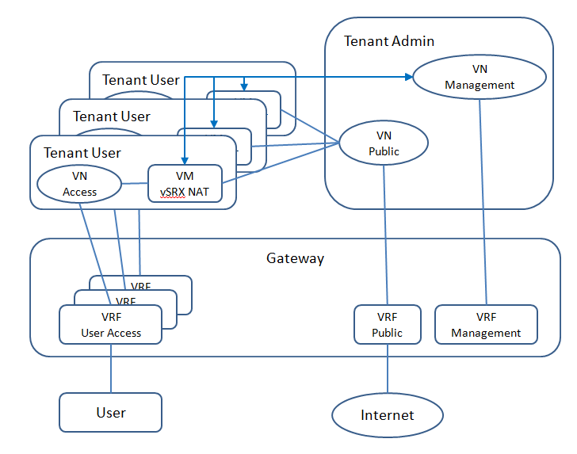

# 1. vSRX and OpenStack
[vSRX](http://www.juniper.net/us/en/products-services/security/firefly-perimeter/#overview) (Firefly Perimeter) is the virtualization of SRX service gateway provided by Juniper.

The KVM-based vSRX is packed in JVA container. It's available [here](http://www.juniper.net/support/downloads/?p=firefly#sw) for download.

## 1.1 Add vSRX image
1. Download vSRX JVA container and unpack it.
```
# chmod 755 junos-vsrx-12.1X46-D20.5-domestic.jva
# ./junos-vsrx-12.1X46-D20.5-domestic.jva -x
```
2. Add vSRX image into OpenStack.
```
# cd junos-vsrx-12.1X46-D20.5-domestic-1400526077
# glance --os-username <admin username> --os-password <admin password> --os-tenant-name admin --os-auth-url http://127.0.0.1:5000/v2.0/ image-create --name "vSRX 12.1X46-D20.5" --disk-format qcow2 --container-format bare --is-public True --file junos-vsrx-12.1X46-D20.5-domestic.img 
```
## 1.2 Launch vSRX instance
Assume a network is already configured in tennant demo.
```
# nova --os-username <admin username> --os-password <admin password> --os-tenant-name demo --os-auth-url http://127.0.0.1:5000/v2.0/ boot vsrx --flavor m1.medium --image "vSRX 12.1X46-D20.5" --nic net-id=<network UUID>
```
Now, vSRX instance can be accessed by console from OpenStack Web UI.
## 1.3 Provisioning vSRX
At the first time when vSRX is launched, there is no configuration applied. Normally, user needs to login vSRX from console to do the initial configuration, like root user authentication and networking interface. After that, any further configuration can be done by mulitple options, management Web on vSRX, SSH, NETCONF, etc.
### 1.3.1 Metadata
This is the standard option for OpenStack to pass data into VM after launching it. VM needs to read from http://169.254.169.254 to get metadata. This is not supported by vSRX yet.
### 1.3.2 File injection
This is another option for OpenStack to transfer data into VM. Potentially, a configuration file can be injected into vSRX and get applied. This is not supported by vSRX yet.
### 1.3.3 Sysinfo
This is the only option supported by vSRX to get data for initial configuration. But it's not supported by OpenStack. To make this work with OpenStack, one additionaly line needs to be added into function get_guest_config_sysinfo() in class LibvirtDriver() in nova/virt/libvirt/driver.py. And service openstack-nova-compute needs to be restarted to apply the update.
```
         sysinfo.system_serial = self.get_host_uuid()
         sysinfo.system_uuid = instance['uuid']
+        sysinfo.bios_version = ';dhcp=yes;rootpw=$1$TCXFwR9d$enGW30hmBFmGNrxIFYPB30;'

         return sysinfo
```
The password is the hashed string of 'passWD'.

This update will add new entry into /var/lib/nova/instances/<uuid>/libvirt.xml for libvirt to create the VM. There is a script in vSRX to read this sysinfo and apply it to configuration. This is the automatic initial provistioning without manual configuration. Then the further provisioning can be done.
# 2. vSRX and Contrail
vSRX can be launched by Contrail service monitor as a service in service chain.
# 3. Demo of NAT
## 3.1 Overview

## 3.2 Prepare
Given a fresh installation, some configurations need to be done to prepare the demo. The config utility is from [here](https://github.com/tonyliu0592/orch).
* As 1.3.3, update openstack-nova-compute on compute node.
* Get code from GitHub.
```
# git clone https://github.com/tonyliu0592/orch.git
# cd orch
# git clone https://github.com/leopoul/ncclient.git
# mv ncclinet.git ncclient.git
# mv ncclient.git/ncclient ./
# rm -fr ncclient.git
```
Check script config to confirm default settings.
* VN "management" and "public" with public address in administration tenant
```
# config --tenant admin add ipam ipam-default
# config --tenant admin add network management --ipam ipam-default --subnet 10.84.53.128/28 --route-target 64512:10284
# config --tenant admin add network public --ipam ipam-default --subnet 10.84.53.48/28 --route-target 64512:10184
```
* Service template
```
# config --tenant admin add service-template vsrx-nat --mode in-network-nat --type firewall --image "vSRX 12.1X46-D20.5" --flavor m1.medium --interface-type management --interface-type left --interface-type right
```
* User tenant "acme"
```
# keystone --os-username admin --os-password <admin password> --os-tenant-name admin --os-auth-url http://127.0.0.1:5000/v2.0/ tenant-create --name acme --enabled true
# keystone --os-username admin --os-password <admin password> --os-tenant-name admin --os-auth-url http://127.0.0.1:5000/v2.0/ user-role-add --user admin --role admin --tenant acme
```
* VN "access"
```
# config --tenant acme add ipam ipam-default
# config --tenant acme add network access --ipam ipam-default --subnet 192.168.1.0/24  --route-target 64512:11000
```
* Configure on the gateway
```
chassis {
    fpc 0 {
        pic 0 {
            tunnel-services;
        }
    }
}
interfaces {
    lt-0/0/0 {
        unit 104 {
            encapsulation frame-relay;
            dlci 184;
            peer-unit 184;
            family inet;
        }
        unit 184 {
            encapsulation frame-relay;
            dlci 184;
            peer-unit 104;
            family inet;
        }
        unit 204 {
            encapsulation frame-relay;
            dlci 100;
            peer-unit 284;
            family inet;
        }
        unit 284 {
            encapsulation frame-relay;
            dlci 100;
            peer-unit 204;
            family inet;
        }
    }
    ge-1/1/0 {
        unit 0 {
            family inet {
                address 10.84.18.253/24;
            }
        }
    }
    lo0 {
        unit 100 {
            family inet {
                address 10.1.1.1/32;
            }
        }
        unit 184 {
            family inet {
                address 1.1.18.4/32;
            }
        }
    }
}
routing-options {
    static {
        route 0.0.0.0/0 next-hop 10.84.18.254;
        route 10.84.53.48/28 next-hop lt-0/0/0.104;
        route 10.84.53.128/28 next-hop lt-0/0/0.204;
    }
    route-distinguisher-id 10.84.18.253;
    autonomous-system 64512;
    dynamic-tunnels {
        dynamic_overlay_tunnels {
            source-address 10.84.18.253;
            gre;
            destination-networks {
                10.84.18.0/24;
            }
        }
    }
}
protocols {
    mpls {
        interface all;
    }
    bgp {
        group contrail {
            type internal;
            local-address 10.84.18.253;
            keep all;
            family inet-vpn {
                unicast;
            }
            neighbor 10.84.18.4;
        }
    }
}
routing-instances {
    access-acme {
        instance-type vrf;
        interface lo0.100;
        vrf-target target:64512:11000;
    }
    management {
        instance-type vrf;
        interface lt-0/0/0.284;
        vrf-target target:64512:10284;
        routing-options {
            static {
                route 0.0.0.0/0 next-hop lt-0/0/0.284;
            }
        }
    }
    public {
        instance-type vrf;
        interface lt-0/0/0.184;
        interface lo0.184;
        vrf-target target:64512:10184;
        routing-options {
            static {
                route 0.0.0.0/0 next-hop lt-0/0/0.184;
            }
        }
    }
}
```
## 3.3 Launch and provisioning service

vsrx-launch --

